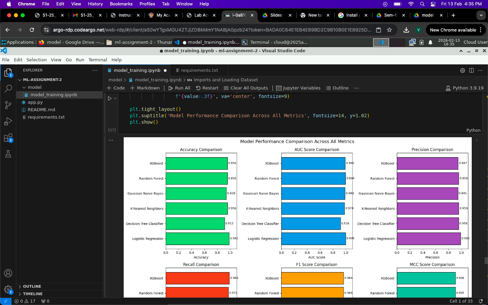

# Breast Cancer Classification - ML Assignment

Code repository for ML Assignment 2

**Deployed Streamlit App:** [https://srivyshnavks-ml-assignment-breast-cancer-classification.streamlit.app/](https://srivyshnavks-ml-assignment-breast-cancer-classification.streamlit.app/)

---

## a. Problem Statement

The objective of this project is to build and evaluate multiple machine learning binary classification models to predict whether a breast tumor is **Malignant (cancerous)** or **Benign (non-cancerous)** based on features computed from digitized images of fine needle aspirate (FNA) of breast masses. Early and accurate detection of breast cancer is critical for effective treatment and improved patient outcomes.

---

## b. Dataset Description

**Dataset:** Breast Cancer Wisconsin (Diagnostic) Dataset

| Attribute | Description |
|-----------|-------------|
| **Source** | UCI Machine Learning Repository / sklearn.datasets |
| **Samples** | 569 |
| **Features** | 30 numerical features |
| **Target Classes** | 2 (Malignant = 0, Benign = 1) |
| **Class Distribution** | Malignant: 212 (37.3%), Benign: 357 (62.7%) |
| **Missing Values** | None |

**Features Description:**
The dataset contains 30 numerical features computed from cell nuclei.

---

## c. Models Used

### i) Model Comparison Table

All 6 classification models were trained and evaluated on the same dataset with an 80-20 train-test split (stratified).

| Model | Accuracy | AUC Score | Precision | Recall | F1 Score | MCC Score |
|-------|----------|-----------|-----------|--------|----------|-----------|
| **Logistic Regression** | 0.9825 | 0.9954 | 0.9861 | 0.9861 | 0.9861 | 0.9623 |
| **Decision Tree Classifier** | 0.9123 | 0.9157 | 0.9559 | 0.9028 | 0.9286 | 0.8174 |
| **K-Nearest Neighbors** | 0.9561 | 0.9788 | 0.9589 | 0.9722 | 0.9655 | 0.9054 |
| **Gaussian Naive Bayes** | 0.9386 | 0.9878 | 0.9452 | 0.9583 | 0.9517 | 0.8676 |
| **Random Forest** | 0.9561 | 0.9937 | 0.9589 | 0.9722 | 0.9655 | 0.9054 |
| **XGBoost** | 0.9561 | 0.9901 | 0.9467 | 0.9861 | 0.9660 | 0.9058 |

**Best Model:** Logistic Regression achieved the highest scores across all metrics.

---

### ii) Model Performance Observations

| Model | Performance Observation |
|-------|------------------------|
| **Logistic Regression** | Best performing model with highest accuracy (98.25%), AUC (0.9954), and MCC (0.9623). Achieved perfect balance between precision and recall (both 0.9861), indicating excellent classification for both malignant and benign cases - indicating high linear correlation between features and target. Feature scaling was applied which contributed to optimal performance. |
| **Decision Tree Classifier** | Lowest performing model with accuracy of 91.23% and lowest AUC (0.9157). While precision is reasonable (0.9559), recall is the lowest (0.9028), meaning it misses more actual benign cases. Prone to overfitting on training data, resulting in weaker generalization. |
| **K-Nearest Neighbors** | Strong performance with 95.61% accuracy and high recall (0.9722). AUC of 0.9788 shows good discriminative ability. Feature scaling helped improve distance-based calculations. Tied with Random Forest for second-best accuracy. |
| **Gaussian Naive Bayes** | Moderate accuracy (93.86%) but surprisingly high AUC (0.9878), suggesting good probability calibration. The independence assumption between features may not fully hold for this dataset, affecting accuracy. Good recall (0.9583) indicates it catches most benign cases. |
| **Random Forest** | Excellent ensemble performance matching KNN with 95.61% accuracy. Very high AUC (0.9937) - second only to Logistic Regression. The ensemble of 100 decision trees provides robust predictions and reduces overfitting compared to single Decision Tree. |
| **XGBoost** | Strong gradient boosting performance with 95.61% accuracy. Highest recall among ensemble models (0.9861), minimizing false negatives. AUC of 0.9901 demonstrates excellent ranking capability. Slightly lower precision (0.9467) indicates few more false positives compared to other models. |

---

## Project Structure

```
breast_cancer_classification_ml_assignment/
├── app.py                 # Streamlit web application
├── requirements.txt       # Python dependencies
├── README.md             # Project documentation
└── model/
    ├── model_training.ipynb    # Jupyter notebook with model training
    ├── logistic_regression.pkl # Saved Logistic Regression model
    ├── decision_tree.pkl       # Saved Decision Tree model
    ├── knn.pkl                 # Saved KNN model
    ├── naive_bayes.pkl         # Saved Naive Bayes model
    ├── random_forest.pkl       # Saved Random Forest model
    ├── xgboost.pkl            # Saved XGBoost model
    ├── scaler.pkl             # Saved StandardScaler
    └── test_data.csv          # Test dataset for evaluation
```

---

## How to Run

1. Install dependencies:
   ```bash
   pip install -r requirements.txt
   ```

2. Run the Streamlit app:
   ```bash
   streamlit run app.py
   ```

3. Upload the test CSV file and select a model to see predictions and evaluation metrics.

---

## Screenshots

### Application Interface




